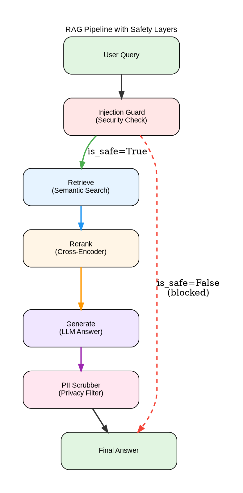

# 🤖 Mini-Wiki Q&A

RAG system with semantic search, reranking, LangGraph orchestration, safety mechanisms, and MLflow experiment tracking.
Built with **LangChain/LangGraph**, **FastAPI**, **Qdrant**, and **Ollama** on **macOS Apple Silicon **.

---

## 🎯 Project Goals

- Build a complete RAG pipeline from scratch
- Learn LangChain → LangGraph migration
- Add evaluation, safety layers, and automation
- Deploy production-ready system
- (Optional) Fine-tune models

---

## 🛠 Tech Stack

| Component | Technology |
|-----------|-----------|
| **Backend** | FastAPI, Python 3.11+ |
| **LLM Orchestration** | LangChain → LangGraph |
| **Vector DB** | Qdrant |
| **LLM Backend** | LM Studio (dev) / Ollama (prod) |
| **Embeddings** | sentence-transformers/all-MiniLM-L6-v2 |
| **Experiment Tracking** | MLflow |
| **Automation** | n8n |
| **Storage** | MinIO |
| **Containerization** | Docker Compose |

---


## 🏗️ Architecture

### RAG Pipeline Flow



**Pipeline Stages:**

1. **🛡️ Injection Guard** — Blocks malicious prompts
2. **🔍 Retrieve** — Semantic search in Qdrant (365 chunks)
3. **🎯 Rerank** — Cross-encoder scoring (optional)
4. **🤖 Generate** — LLM answer with context
5. **🔒 PII Scrubber** — Remove sensitive data

**Flow:**
- ✅ Green path: Normal query flow
- ❌ Red dashed: Blocked injection attempts

### Generate Visualization

To regenerate the pipeline diagram:
```bash
# Generate PNG/SVG/TXT visualizations
docker compose exec api python /scripts/generate_pipeline_image.py
docker compose exec api python /scripts/visualize_graph.py

# Output files in data/:
# - rag_pipeline.png (diagram)
# - rag_pipeline.svg (scalable vector)
# - rag_pipeline_visualization.txt (ASCII art + details)
```
---

### Safety Features
- 🛡️ **Injection Guard** — Blocks prompt injection
- 🔒 **PII Scrubber** — Removes sensitive data
- 📊 **MLflow + MinIO** — Experiment tracking with S3 storage

### Available Endpoints
- `/ask` — LangChain pipeline
- `/ask-graph` — LangGraph pipeline with safety layers


## 📋 Prerequisites

- **macOS M-series**
- **Docker Desktop** (12GB RAM allocation)
- **LM Studio** (GUI for development)
- **Ollama** (CLI for production)
- **Git**

---

## 🚀 Quick Start

### 1. Setup environment
```bash
make setup
# Creates .env from .env.example, creates data directories
```

### 2. Configure .env
```bash
# Edit .env and set:
# - LLM_BACKEND (lm-studio for development, ollama for production)
# - API_SHARED_SECRET (change default!)
```

### 3. Start all services
```bash
make all
# Builds Docker images and starts all services
```

### 4. Verify installation
```bash
make test
# Checks: LM Studio, Ollama, API, Qdrant
```

### 5. Open UIs
```bash
make ui-all
# Opens: API docs, Qdrant, MLflow, MinIO, n8n
```

### 7. Setup Data

#### Download SQuAD dataset
``` 
python scripts/download_squad.py
```
#### Ingest documents
```
docker compose run --rm api python -m rag.ingest
```
---

## 📁 Project Structure
```
mini-wiki-qa/
├── app/
│   ├── api/              # FastAPI endpoints
│   ├── rag/              # RAG pipeline (ingest, retrieval, generation)
│   ├── eval/             # Evaluation scripts
│   ├── safety/           # Safety layers (PII, injection guard)
│   └── Dockerfile
├── data/
│   ├── documents/        # Your .md files (30-50 docs)
│   └── golden_set/       # Q&A pairs for evaluation
├── scripts/              # Utility scripts
├── compose.yml           # Docker services
├── Makefile              # Automation commands
├── .env.example          # Environment template
└── README.md
```

---

## 🔧 Common Commands
```bash
# Setup
make setup              # Create .env, data dirs
make all                # Setup + build + start

# Service management
make up                 # Start services
make down               # Stop services
make restart            # Restart services
make ps                 # Service status
make clean              # Stop + remove volumes

# Logs
make logs               # All logs
make logs-api           # API logs only
make logs-qdrant        # Qdrant logs only

# UI shortcuts
make ui-all             # Open all UIs
make ui-api             # API docs (Swagger)
make ui-qdrant          # Qdrant dashboard
make ui-mlflow          # MLflow tracking
make ui-n8n             # n8n workflows

# Health check
make test               # Test all services
```

---

## 🌐 Service URLs

| Service | URL | Description |
|---------|-----|-------------|
| **API** | http://localhost:8000/docs | FastAPI Swagger UI |
| **Qdrant** | http://localhost:6333/dashboard | Vector database |
| **MLflow** | http://localhost:5001 | Experiment tracking |
| **MinIO** | http://localhost:9001 | Object storage (admin/admin) |
| **n8n** | http://localhost:5678 | Workflow automation |
| **LM Studio** | http://localhost:1234 | LLM server (local) |
| **Ollama** | http://localhost:11434 | LLM server (production) |

---

## 📊 Expected Metrics

| Metric | Baseline | With Rerank | With Multi-Query |
|--------|----------|-------------|------------------|
| Recall@3 | 0.65 | 0.75-0.80 | 0.80-0.85 |
| Recall@5 | 0.75 | 0.85-0.90 | 0.90-0.95 |
| Latency | 800ms | 1200ms | 1500ms |

---

### Evaluation Results (SQuAD dataset)

| Metric | Baseline | With Reranking |
|--------|----------|----------------|
| Recall@3 | 58% | 44% |
| Recall@5 | 66% | 58% |

*Note: Reranking shows lower metrics on duplicate-heavy datasets. Performance improves significantly on diverse document collections.*


## 🐛 Troubleshooting

**LM Studio not responding:**
```bash
# Check LM Studio UI → Start Server (port 1234)
curl http://localhost:1234/v1/models
```

**API cannot reach LM Studio:**
```bash
# Verify compose.yml uses: host.docker.internal:1234
# (macOS specific)
```

**Docker out of memory:**
```bash
# Docker Desktop → Settings → Resources:
# - Memory: 12GB+
# - CPUs: 6
```

**Port conflict:**
```bash
lsof -i :8000
kill -9 [PID]
```

---

## 🎯 Roadmap

### Completed ✅
- [x] Infrastructure setup (Docker, Qdrant, MLflow)
- [x] Basic RAG with LangChain
- [x] Evaluation metrics + golden set
- [x] Reranking with cross-encoder
- [x] LangGraph migration
- [x] Safety layers (injection guard, PII scrubber)
- [x] Pipeline visualization
- [x] MinIO integration (S3-compatible storage)

### Planned 🔮
- [ ] n8n integrations (Telegram bot, Google Sheets)
- [ ] Production deployment with Ollama
- [ ] Fine-tuning (embeddings, reranker, LLM)
- [ ] Multi-query expansion
- [ ] Conversational memory

## 📝 License

MIT License